# Td5MapEditor User Manual

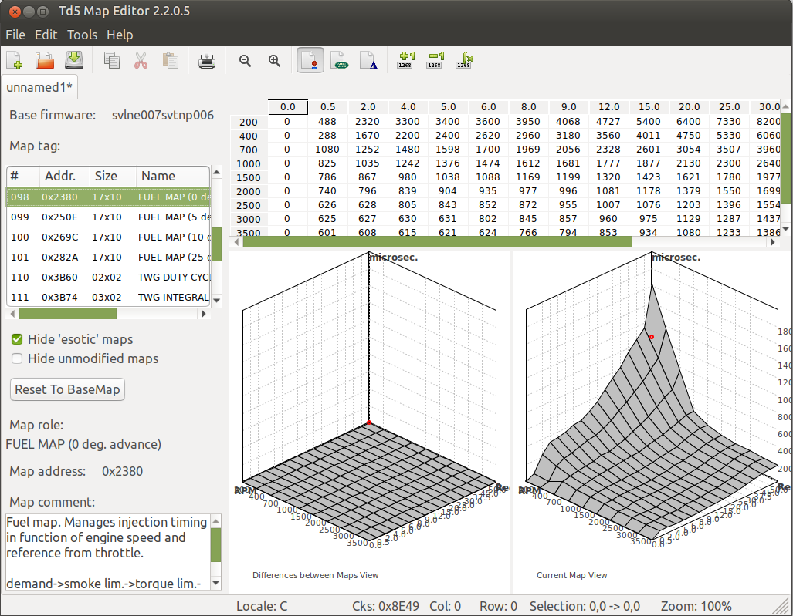

**Td5MapEditor** is a simple map editor for Land Rover Td5 ECU map files in **Nanocom `.map` format**.

It is similar in spirit to many tuning tools, but intentionally narrow in scope: it is designed for **Td5 NNN ECUs** and Nanocom map files only. The program recognises the known tables and scalars contained in the file, displays them as an editable grid, and shows the selected table as a 3D graph. Relevant tuning tables include descriptions, curve meaning, and units where available.

Td5MapEditor recalculates the Nanocom checksum while editing and applies the internal checksum corrections automatically when the file is updated/saved, so no separate checksum operation is normally required after saving the tuned map.

> [!WARNING]
> ECU tuning can damage an engine, drivetrain, or vehicle if done incorrectly. This software is intended for advanced Td5 tuners and technically skilled enthusiasts who understand Td5 maps, Nanocom files, and the risks of flashing modified ECU data. Always keep verified backups of original files and test changes carefully.

---

## Supported ECU/file formats

| Item | Support status |
|---|---|
| Land Rover Td5 NNN ECU Nanocom `.map` files | Supported |
| Embedded original Land Rover NNN base maps | Supported through **File → New** |
| Tuning export/import `.t5n` files | Supported |
| TunerPro `.xdf` import | Experimental |
| Non-Nanocom binary formats | Not supported by this manual |
| Non-Td5 ECUs | Not supported |

---

## Target users

Td5MapEditor is aimed at:

- advanced Td5 tuners;
- Td5 enthusiasts who already understand ECU map editing;
- developers who are comfortable building C++ software with `g++`, MinGW, wxWidgets, Code::Blocks, or Makefiles.

It is **not** intended as a beginner tuning tutorial. The program helps edit and visualise data; it does not decide safe tuning values for you.

---

## Basic concepts

### Base map

The **base map** is the original reference map used by the project. When you create a new map with **File → New**, Td5MapEditor lets you select one of the embedded original Land Rover NNN maps.

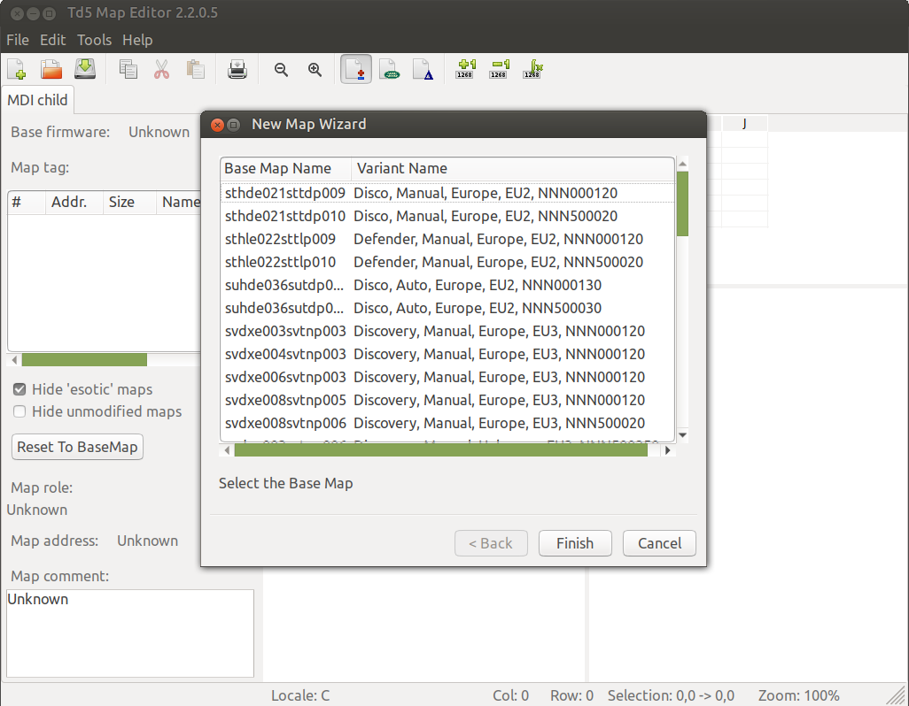

### Current map

The **current map** is the version you are editing. These are the values that will be saved into the output Nanocom `.map` file.

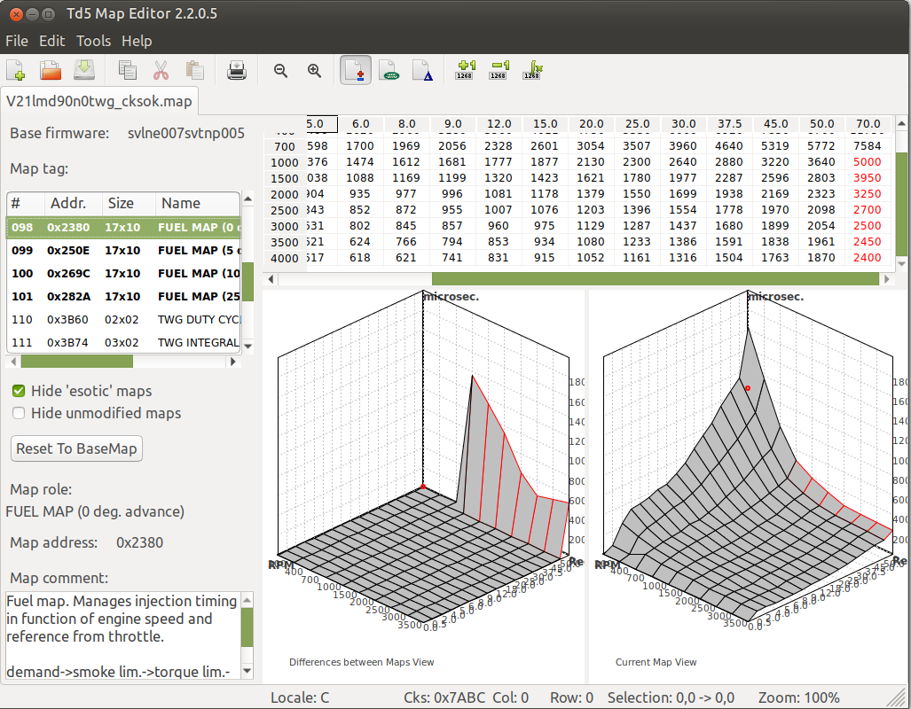

### Original map view

The **original map view** shows the selected table as it exists in the base map. Use it as a reference while tuning.

### Differences view

The **differences view** shows how the current map differs from the base map. This is useful for checking the shape and size of your changes before saving or flashing.

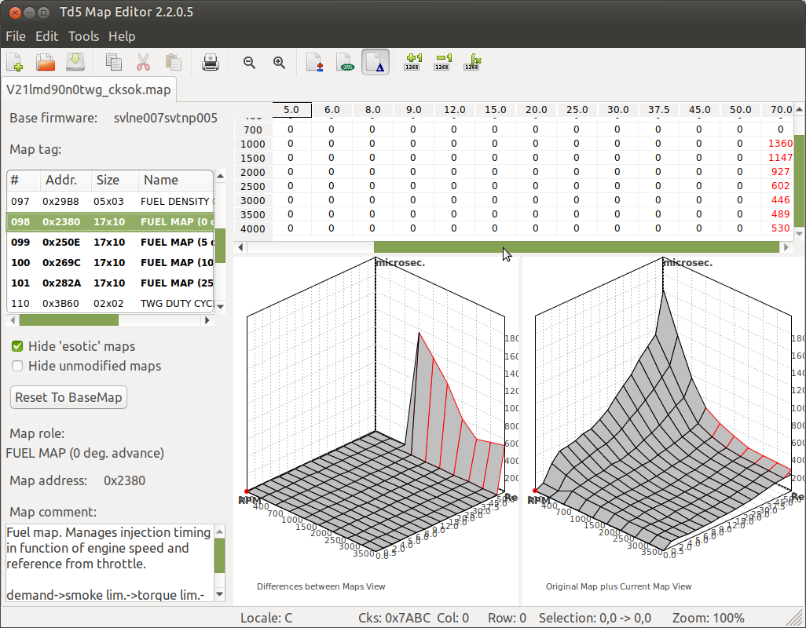

### Maps and scalars

Td5MapEditor shows recognised map data in the left panel. Tables are displayed as grids and 3D graphs. Single-value items/scalars are also listed, using a different colour in the map list.

---

## Main window overview

The main window is divided into four practical areas:


1. **Menu bar and toolbar** — file operations, editing commands, view switching, zoom, and tuning tools.
2. **Map list and information panel** — recognised tables/scalars, base firmware name, map tag, map role, address, and comments.
3. **Grid editor** — spreadsheet-like view of the selected table.
4. **3D graph area** — visual representation of the selected table and/or its differences from the base map.

The status bar at the bottom shows useful editing information, including the current checksum value.

---

## Recommended workflow

### 1. Start from a known original map

Use **File → New** to create a new project from one of the embedded original Land Rover NNN maps.

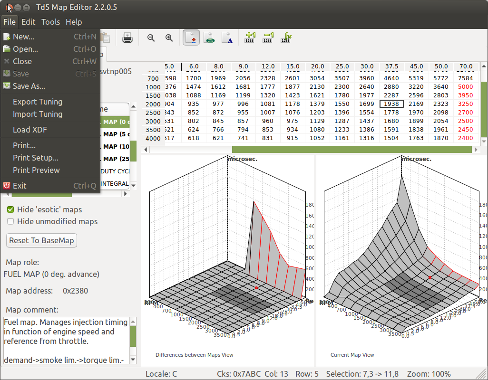

In the wizard, select the base map that matches the ECU/map variant you want to tune, then finish the wizard.


You can also use **File → Open** to open an existing Nanocom `.map` file, for example a previously saved tuned file.

### 2. Select a table or scalar

Use the left map list to select the table you want to inspect or edit.

The list columns show:

| Column | Meaning |
|---|---|
| `#` | Internal table index |
| `Addr.` | Map address inside the file |
| `Size` | Table size, columns × rows |
| `Name` | Table/scalar name or role |

When a table is selected, the lower part of the left panel shows its role, address, and comment.

### 3. Inspect the table

The selected table is shown as:

- a spreadsheet-like grid;
- a 3D graph of the current map;
- a comparison/difference graph when using difference view.

Use this step to understand the map shape before changing values. This is especially important for fuel, boost, limiter, and smoke-related tables where shape is often as important as the absolute numbers.

### 4. Edit values

You can edit values directly in the grid. Common operations are available from the toolbar, menu, and grid context menu.

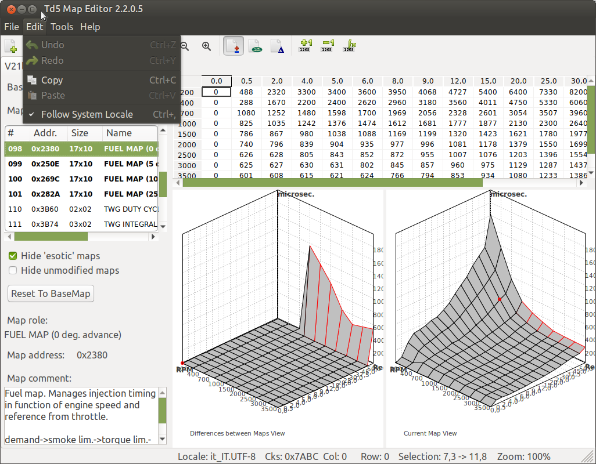

Useful actions:

| Action | Use |
|---|---|
| Edit a cell | Change a single value directly in the grid |
| Copy | Copy the selected cells to the clipboard |
| Paste | Paste compatible tabular data from the clipboard |
| Value(s) +1 | Increase selected value(s) by one unit |
| Value(s) -1 | Decrease selected value(s) by one unit |
| Edit Range of Values | Apply a controlled edit over a rectangular selection |

The grid copy/paste behaviour is designed to be compatible with spreadsheet tools such as LibreOffice Calc, OpenOffice Calc, and Microsoft Excel.

### 5. Edit a range of values

Select a rectangular range in the grid, then use **Tools → Edit Range of Values**.

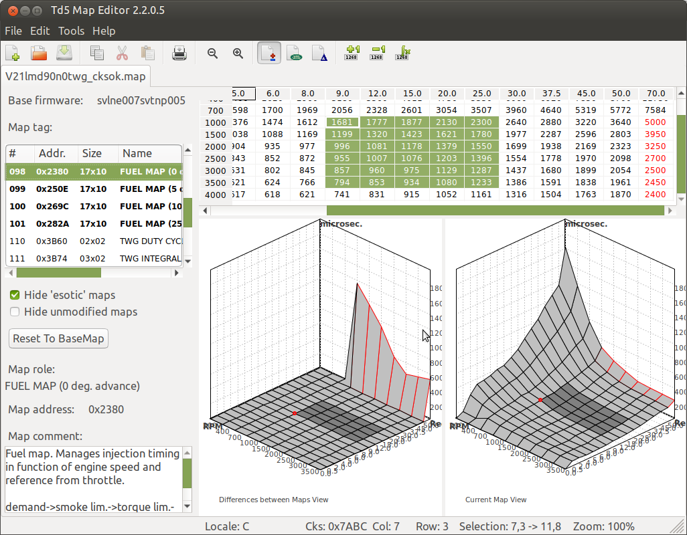

The dialog lets you define the top-left, top-right, bottom-left, and bottom-right corner values. Td5MapEditor then interpolates the values across the selected area.

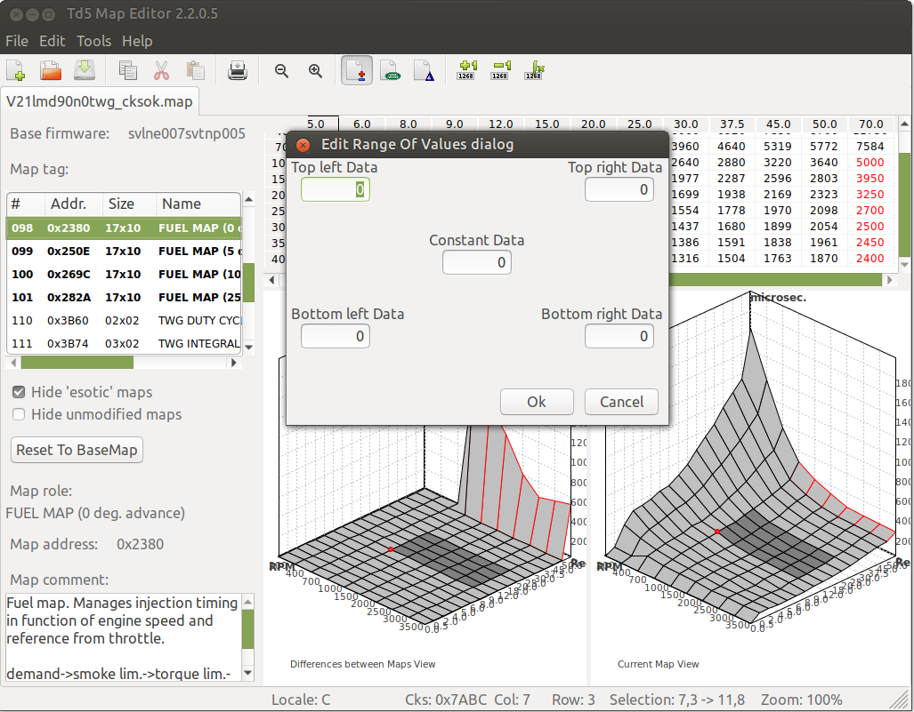

This is useful when you want a smooth transition instead of manually editing each cell.

### 6. Compare current values with the original map

Use the view tools to switch between current values, original values, and differences.

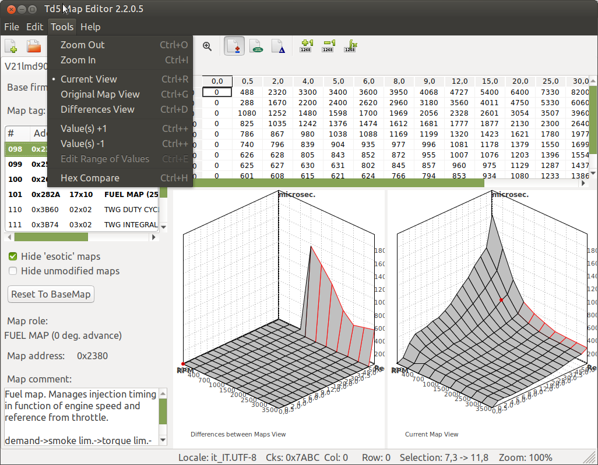

| View | Purpose |
|---|---|
| **Current View** | Shows the map as currently edited |
| **Original Map View** | Shows the original/base map values |
| **Differences View** | Shows the difference between current and base values |

Cells and labels can use colour to highlight differences. Positive and negative changes are shown differently, making it easier to spot unexpected edits.

### 7. Save the tuned map

Use **File → Save As** when creating a new tuned file, so the original map remains untouched.

When saving, Td5MapEditor writes the edited table data back into the Nanocom map file and recalculates the required checksum information automatically.

Recommended naming style:

```text
original_file_name_description.map
```

Example:

```text
svlne007_stage1_test01.map
```

Keep a separate folder with untouched original maps. Do not overwrite your only known-good file.

---

## File menu


| Command | Description |
|---|---|
| **New** | Create a new Nanocom map from an embedded original Land Rover NNN base map |
| **Open** | Open an existing `.map` file |
| **Close** | Close the current map window |
| **Save** | Save the current map |
| **Save As** | Save the current map with a new filename |
| **Export Tuning** | Export only modified table data to a `.t5n` tuning file |
| **Import Tuning** | Import a `.t5n` tuning file into the current map |
| **Load XDF** | Load a TunerPro `.xdf` file; experimental |
| **Print / Print Setup / Print Preview** | Print or preview map data |
| **Exit** | Close the application |

### Export/Import tuning files

The `.t5n` tuning file contains the differences from the base map for modified tables. It is useful when you want to transfer the same tune to another compatible base map/project.

When importing, Td5MapEditor checks table dimensions. If a table size differs, it may ask whether to import anyway. Be careful: importing tuning data into a mismatched map can produce incorrect results.

---

## Edit menu


| Command | Description |
|---|---|
| **Undo / Redo** | Standard document editing commands where available |
| **Copy** | Copy selected grid cells |
| **Paste** | Paste compatible grid data |
| **Follow System Locale** | Use the system locale for numeric formatting |

If copy/paste with spreadsheets behaves strangely, check decimal separator settings and the **Follow System Locale** option.

---

## Tools menu


| Command | Shortcut shown by the UI | Description |
|---|---:|---|
| **Zoom Out** | `Ctrl+O` | Decrease graph/grid zoom |
| **Zoom In** | `Ctrl+I` | Increase graph/grid zoom |
| **Current View** | `Ctrl+R` | Show current edited values |
| **Original Map View** | `Ctrl+G` | Show base/original values |
| **Differences View** | `Ctrl+D` | Show differences between current and base values |
| **Value(s) +1** | `Ctrl++` | Increase selected cell(s) by one unit |
| **Value(s) -1** | shown in UI | Decrease selected cell(s) by one unit |
| **Edit Range of Values** | `Ctrl+E` | Edit/interpolate a selected rectangular area |
| **Hex Compare** | `Ctrl+H` | Show raw word-level differences between current and base data |

---

## Working with the map list

The left panel helps you focus on the relevant maps.

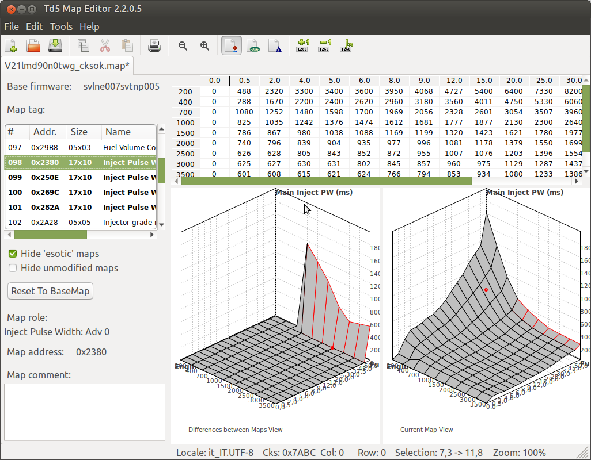

| Control | Purpose |
|---|---|
| **Hide 'esotic' maps** | Hides less common/unrecognised/special maps from the list |
| **Hide unmodified maps** | Shows only tables that differ from the base map |
| **Reset To BaseMap** | Resets the selected table to its base-map values |
| **Map role** | Human-readable table/scalar role |
| **Map address** | Address of the selected table/scalar in the map file |
| **Map comment** | Notes, description, and units where available |

A good review habit is to enable **Hide unmodified maps** before saving. It gives you a compact list of what the tune actually changed.

---

## XDF import — experimental

Td5MapEditor can load a TunerPro `.xdf` file through **File → Load XDF**.


This feature is experimental and must be used with great caution.

Important notes:

- XDF definitions may not match the opened Nanocom map.
- Addresses, axes, conversion formulas, and scalar definitions can be wrong or incomplete.
- A table appearing in the UI does not automatically mean it is safe or meaningful for the loaded map.
- Always verify imported XDF entries against known Td5 information before editing.
- Do not flash a file only because it loads correctly after XDF import.

A safe use of XDF import is exploratory analysis. Treat XDF-based edits as untrusted until independently verified.

---

## Windows version

The Windows version provides the same basic workflow and layout.

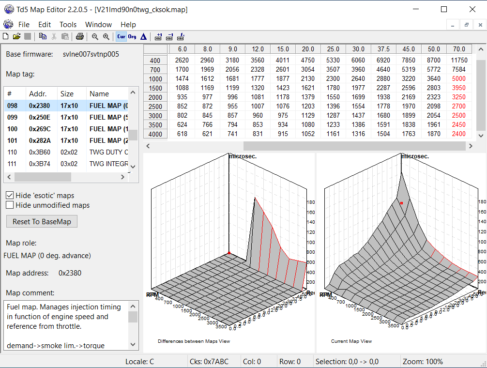

The main differences are platform-related: window theme, fonts, and native file dialogs. The map editing workflow is the same.

---

## Building from source

Building Td5MapEditor requires C++ development experience. The project uses wxWidgets and can be built on Linux and Windows.

### Source tree

Typical repository layout:

```text
Td5MapEditor/
├── src/                    # C++ source files
│   ├── tinyxml/             # Bundled TinyXML sources
│   └── baseMaps.cpp/.h      # Embedded original map resources
├── linux_x64/               # Linux build output
├── win64/                   # Windows build output
├── .vscode/                 # VS Code tasks/debug configuration
├── Makefile                 # Linux Makefile
├── Makefile.win             # Windows MinGW Makefile
└── td5mapeditor.cbp         # Code::Blocks project
```

`baseMaps.cpp` is intentionally large because it contains embedded base-map resources.

### Linux dependencies

On Debian/Ubuntu/Linux Mint systems:

```bash
sudo apt update
sudo apt install build-essential gdb make libwxgtk3.2-dev
```

The Linux Makefile uses:

```bash
wx-config --cflags
wx-config --libs
```

so `wx-config` must be available in `PATH`.

### Build on Linux with Makefile

From the repository root:

```bash
make debug
```

or:

```bash
make release
```

Clean build files:

```bash
make clean
```

Output files:

```text
linux_x64/debug/td5mapeditor
linux_x64/release/td5mapeditor
```

The Makefile supports parallel builds and normally uses about half of the available CPU cores. You can override it manually:

```bash
make -j8 release
```

### Build/debug on Linux with VS Code

Open the repository folder in VS Code.

Common commands:

| Command | Action |
|---|---|
| `Ctrl+Shift+B` | Build the default target |
| `F5` | Build Debug and start the debugger |
| `Ctrl+Shift+P → Tasks: Run Task` | Choose Debug, Release, or Clean |

The VS Code configuration calls the Linux Makefile, so builds are incremental.

### Build on Linux with Code::Blocks

Open:

```text
td5mapeditor.cbp
```

Select a Linux target such as:

```text
Linux x64 Debug
Linux x64 Release
```

Then build normally from Code::Blocks.

### Windows dependencies

The current Windows configuration targets:

```text
Code::Blocks 25.03
Bundled MinGW-W64 x86_64-ucrt-posix-seh
GCC 14.2.0
wxWidgets 3.2.x static build
```

Expected default wxWidgets path:

```text
C:/wxWidgets-3.2
```

Expected static wxWidgets library folder:

```text
C:/wxWidgets-3.2/lib/gcc1420UCRT_x64
```

If your paths differ, edit `Makefile.win`.

### Build on Windows with Code::Blocks

Open:

```text
td5mapeditor.cbp
```

Select:

```text
Win64 Debug
Win64 Release
```

Build normally from Code::Blocks.

### Build on Windows with Makefile.win

From the repository root, in a terminal where `mingw32-make` is available:

```bat
mingw32-make -f Makefile.win debug
```

or:

```bat
mingw32-make -f Makefile.win release
```

Clean:

```bat
mingw32-make -f Makefile.win clean
```

Output files:

```text
win64/debug/td5mapeditor.exe
win64/release/td5mapeditor.exe
```

`Makefile.win` does not use `wx-config`, because `wx-config` is normally not available in a standard Windows MinGW setup. Instead it explicitly defines wxWidgets include paths, wxWidgets libraries, and the required Windows system libraries.

---

## Suggested safe tuning practice

Before editing:

1. Save an untouched backup of the original Nanocom file.
2. Create a working copy with a clear filename.
3. Make small, traceable changes.
4. Use **Differences View** and **Hide unmodified maps** to review exactly what changed.
5. Save each meaningful tuning step as a new file.
6. Keep notes outside the program explaining what was changed and why.

Before flashing:

- confirm that the file is for the correct ECU/map variant;
- confirm the modified tables are the intended ones;
- confirm no accidental pasted values or range edits are present;
- keep a known-good recovery file available.

---

## Troubleshooting

### The file opens but few or no maps are recognised

Possible causes:

- the file is not a supported Nanocom `.map` file;
- the ECU/map variant is not known to Td5MapEditor;
- **Hide 'esotic' maps** is hiding unrecognised entries.

Try disabling **Hide 'esotic' maps** to inspect more entries.

### Spreadsheet paste gives unexpected values

Check:

- decimal separator settings;
- **Follow System Locale**;
- whether the spreadsheet copied tabs/newlines in the expected format;
- whether the selected paste area matches the copied data size.

### XDF-loaded maps look wrong

Assume the XDF entry is mismatched until proven otherwise. Verify the address, dimensions, axes, and conversion formula before editing.

### Windows build cannot find wxWidgets

Check the paths in `Makefile.win`, especially:

```makefile
MINGW_DIR ?= C:/Program Files/CodeBlocks/MinGW
WX_DIR    ?= C:/wxWidgets-3.2
WX_LIB    ?= $(WX_DIR)/lib/gcc1420UCRT_x64
```

Also confirm wxWidgets was built with the same MinGW/GCC/UCRT toolchain used to build Td5MapEditor.

---

## Licence

Td5MapEditor is distributed under the GNU licence included with the project.
